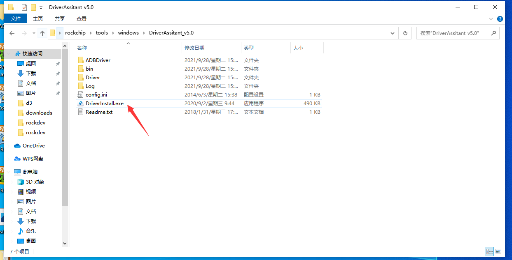
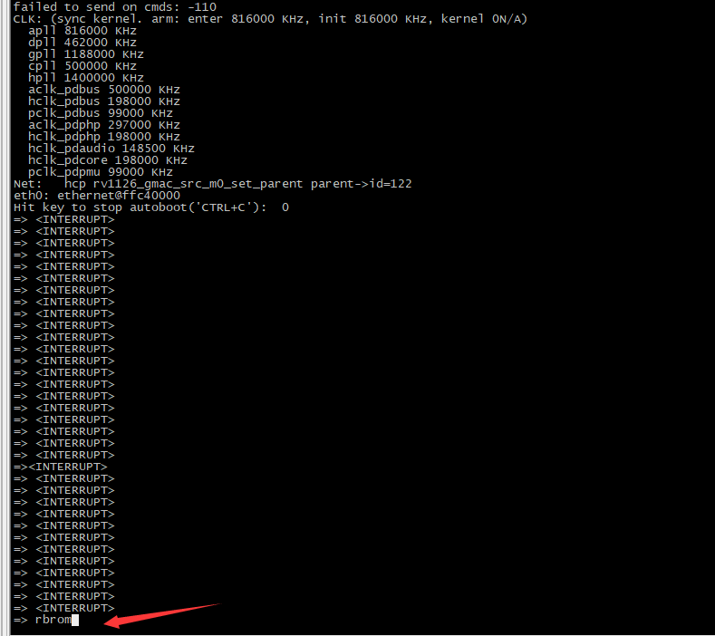
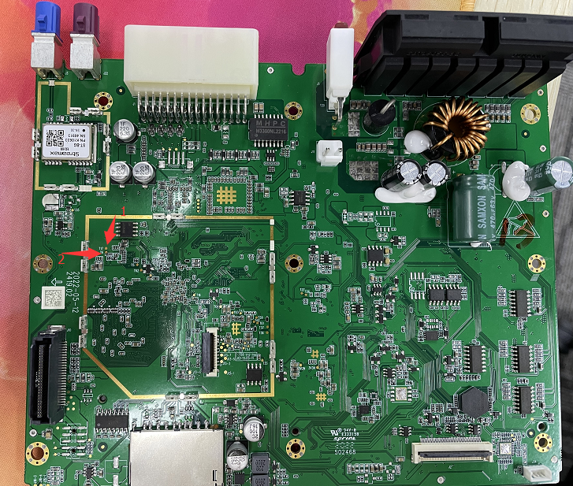
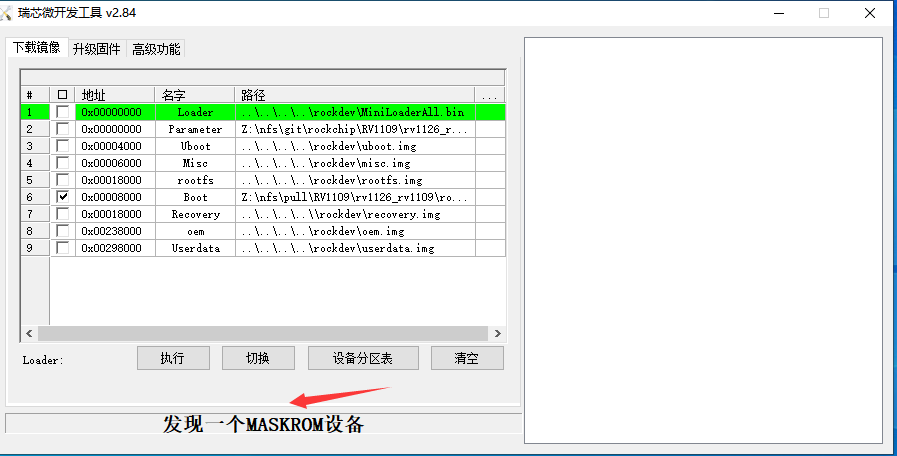
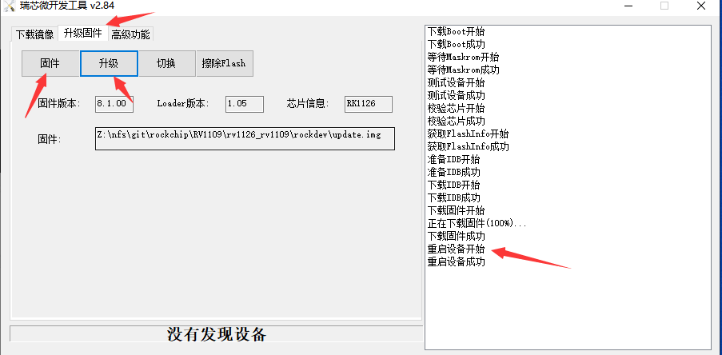

# 瑞芯微小系统烧录及分区配置 主要涉及产品 D3

## 网口烧录设置板子及PC的IP地址 -推荐使用

- 重启设备 按住ctrl+C进入uboot阶段
- setenv ipaddr 192.168.55.211;setenv serverip 192.168.55.111
- ping 192.168.55.111
- 网络正常如下图所示(192.168.55.211 192.168.55.111修改为你自己实际使用的IP)
  

## 分区烧录

- **tftpflash [loadAddress] [bootfilename] [partition]**
- **注意: tftpflash 0x20000000 后面的字段为文件名 请修改为实际使用文件名**

### loader烧录

- 暂不开放loader的烧录 也尽量不要自己烧录loader

### fdt烧录

- tftpflash 0x20000000 STM_D3_FDT_T22021600 resource

### uboot烧录

- tftpflash 0x20000000 STM_D3_UBOOT_T22021600 uboot

### kernel烧录

- tftpflash 0x20000000 STM_1126_KERNEL_T22021600 boot

### rootfs烧录

- tftpflash 0x20000000 STM_D3_ROOTFS_T22021600 rootfs

### backupsystem烧录

- tftpflash 0x20000000 STM_RV1126_BKSYSTEM_T22021600 BKSystem

### APP_LOCAL

- tftpflash 0x20000000 STM_APPLOCAL_T22021600 AppLocal

### APP_EXTEND

- tftpflash 0x20000000 STM_APPLOCAL_T22021600 AppExt

### 清除参数区

- mmc erase 0x001FE000 0x00001000;

### 清除状态区

- mmc erase 0x001FF000 0x00001000;

### 清除local分区

- mmc erase 0x00058000 0x00080000

## 备注

### uboot阶段status的操作

----

- status:
status get -> 获取所有status状态  
status set crc -> 主动更新flash crc状态  
status clr crc -> 清除flash crc状态  
status set cnt 0 -> 更新ERROR_COUNT计数，最后的参数0表示计数值，当cnt > 2时会进行crc校验，校验不通过则进入到备份系统中进行升级  

----

### dd操作指令

----

- dd指令详解
例如dd if=/dev/mmcblk0p2 of=uboot bs=1M count=1  
if=文件名：输入文件名，缺省为标准输入。即指定源文件。< if=input file >
of=文件名：输出文件名，缺省为标准输出。即指定目的文件。< of=output file >  
bs读入/输出的块大小为bytes个字节
count为块个数
上例的含义为从/dev/mmcblk0p2这个文件 拷贝块大小为1M 块个数为1个（即1*1M）的大小字节到当前的uboot文件中

- 镜像拷贝 rootfs环境下:
dd if=/dev/mmcblk0 of=all bs=1M count=1024  
dd if=/dev/mmcblk0p1 of=uboot bs=1M count=4  
dd if=/dev/mmcblk0p2 of=resource bs=1M count=4  
dd if=/dev/mmcblk0p3 of=kernel bs=1M count=16  
dd if=/dev/mmcblk0p4 of=bksystem bs=1M count=16  
dd if=/dev/mmcblk0p5 of=rootfs bs=1M count=128  
dd if=/dev/mmcblk0p6 of=AppLocal bs=1M count=256  
dd if=/dev/mmcblk0p7 of=AppExt bs=1M count=588  
dd if=/dev/mmcblk0p8 of=SysParaCusPara bs=1M count=2  
dd if=/dev/mmcblk0p9 of=SysStatus bs=1M count=2  

- 镜像清除
dd if=/dev/zero of=/dev/mmcblk0p2 bs=1M count=1  
其余分区参照镜像拷贝规划

- 镜像烧录
先mount文件夹到/var/run/tool目录下  
dd if=/var/run/tool/uboot of=/dev/mmcblk0p1 bs=1M count=4  
其余分区参照镜像拷贝规划

----

### 环境变量

----

user_debug=31 flashsize=8192M chiptype=176 UartConfig=1 UartPinNum=16 EtherConfig=0 AuthSerial=00C6000000 MachineType=0 HardwareVer=0 DevVersion=0 blkdevparts=mmcblk0:4M@8M(uboot),4M@12M(resource),16M@16M(boot),16M@32M(BKSystem),128M@48M(rootfs),256M@176M(AppLocal),588M@432M(AppExt),2M@1020M(SysParaCusPara),2M@1022M(SysStatus),2048M@1024M(data1),-(data2) storagemedia=emmc androidboot.storagemedia=emmc androidboot.mode=normal mtdparts=rk29xxnand:0x00002000@0x00004000(uboot),0x00002000@0x00006000(resource),0x00008000@0x00008000(boot),0x00008000@0x00010000(BKSystem),0x00040000@0x00018000(rootfs),0x00080000@0x00058000(AppLocal),0x00126000@0x000D8000(AppExt),0x00001000@0x001FE000(SysParaCusPara),0x00001000@0x001FF000(SysStatus),0x00400000@0x00200000(data1),-@0x00600000(data2:grow) uuid:rootfs=614e0000-0000-4b53-8000-1d28000054a9 rootwait earlycon=uart8250,mmio32,0xff570000 console=ttyFIQ0 root=PARTUUID=614e0000-0000 snd_aloop.index=7

Number  Start (sector)    End (sector)  Size Name  
1           16384           24575 4096K uboot  
2           24576           32767 4096K resource  
3           32768           65535 16.0M boot  
4           65536           98303 16.0M BKSystem  
5           98304          360447  128M rootfs  
6          360448          884735  256M AppLocal  
7          884736         2088959  588M AppExt  
8         2088960         2093055 2048K SysParaCusPara  
9         2093056         2097151 2048K SysStatus  
10         2097152         6291455 2048M data1  
11         6291456        15269823 4383M data2  

----

## USB烧录

- USB烧录主要用于未烧录镜像的裸板及无法启动uboot等异常情况使用过的一种烧录方式

### 准备的环境及工具

- USB前面板及一根USB烧录线，三针串口线

- 瑞芯微PC端烧录工具(RKDevTool.exe)

- PC端安装USB驱动(tools/windows/DriverAssitant_v4.91.zip)

- 一个镊子以及盖帽（用线短接也行）

- update.img烧录包

### 步骤

#### 安装USB驱动

1. 点击DriverInstall.exe进行安装

2. **先点击卸载驱动**

3. **再点击安装驱动**

#### USB接入PC端和前面板U口

#### 进入maskrom烧录模块

- **若未烧录过EMMC镜像，即裸板EMMC上无任何数据的情况下，设备会自动进入maskrom烧录模式**

- **若烧录过EMMC 且UBOOT能启动的情况下 接入串口 在UBOOT的命令阶段输入rbrom 设备进入maskrom模式 若下图所示**

- **若烧录过EMMC 但是设备挂了 UBOOT无法起来 需要短接焊点**

- **如下图所示 1号点和2号点需要用镊子或者线短接即可**

#### PC端烧录固件

- 完成上述步骤后，即可在电脑端看到发现一个maskrom设备，表示PC已经识别到设备进入maskrom模块 如下图所示

- 接着点击升级固件选项切换页面，点击固件，选择update.img镜像，点击升级，烧录完成后设备自动重启，如下图所示

